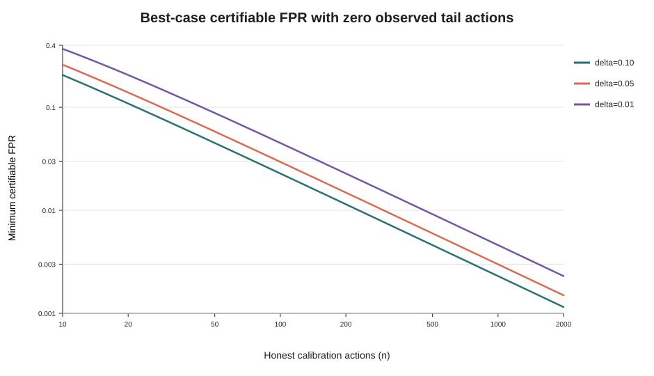
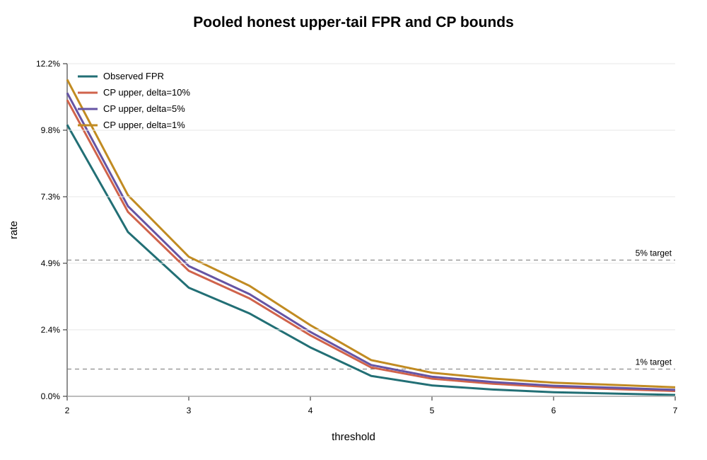
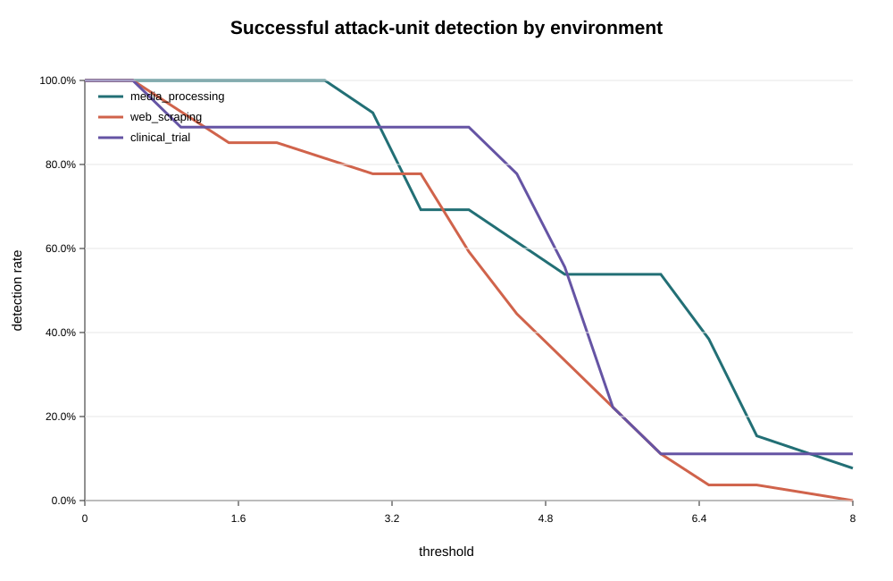
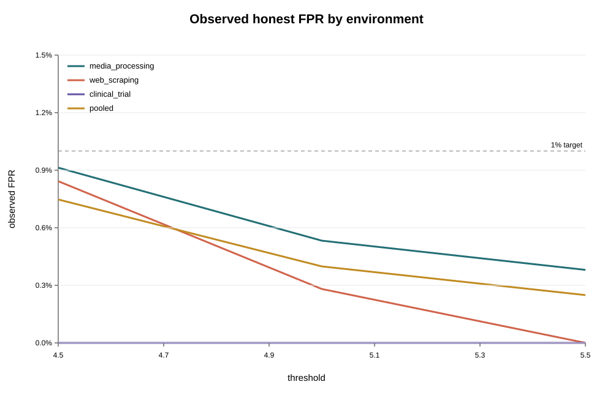

# Certified Audit-Budget Thresholding for Action Monitors

## Summary

An observed false-positive rate is not automatically an auditable
false-positive-rate claim. We apply one-sided Clopper-Pearson bounds and
descending fixed-sequence Learn-then-Test to select a deterministic action
threshold whose claimed audit budget is statistically supportable.

On 2,007 pooled honest actions scored by the Track A `multi` baseline:

| Method | Threshold | Observed FPR | CP 90% | CP 95% | CP 99% | 1% claim |
|---|---:|---:|---:|---:|---:|:---:|
| Empirical | 4.5 | 0.75% | 1.06% | 1.15% | 1.33% | Not certified |
| Certified | 5.0 | 0.40% | 0.65% | 0.72% | 0.87% | Certified |

The empirical threshold detects more attacks, but its 1% budget claim is not
supported by the available honest data. Threshold `5.0` is the most permissive
deterministic threshold among the observed `multi` score grid points for which
the 1% promise is auditable at every tested confidence level.

Certification does not improve monitor ranking. It determines which operating
point can be reported with a finite-sample FPR guarantee.

## Why Sample Size Matters

For `k=0` observed honest tail actions, a one-sided confidence level
`1 - delta` requires:

```text
n >= ln(delta) / ln(1 - alpha)
```

At a 1% target:

| Tail flags | Delta 0.10 | Delta 0.05 | Delta 0.01 |
|---:|---:|---:|---:|
| k=0 | 230 | 299 | 459 |
| k=1 | 388 | 473 | 662 |

A non-empty honest tail rapidly raises the required calibration size. These
limits are exact feasibility results: they say whether an FPR claim is
supportable, not whether the monitor is good at ranking attacks.



## Data

All final results use the discrete Track A `multi` action monitor, whose scores
lie on a 0.5-point grid.

### Honest actions

| Environment | Trajectories | Valid actions | Share of pooled actions |
|---|---:|---:|---:|
| `media_processing` | 15 | 1,314 | 65.47% |
| `web_scraping` | 5 | 356 | 17.74% |
| `clinical_trial` | 7 | 337 | 16.79% |
| **Pooled** | **27** | **2,007** | **100%** |

### Attacks

The attack unit is one maximum valid action score per successful LaStraj
attack trajectory.

- 76 successful attack units across eight environments.
- 49 attacks are in environments with matched honest calibration data:
  13 media, 27 web, and 9 clinical.
- The remaining 27 attacks span five environments without matched honest
  calibration and are reported descriptively only.

## Core Result

At threshold `4.5`, 15 of 2,007 pooled honest actions are flagged. The observed
rate is 0.75%, but the one-sided CP upper bound is 1.06% at `delta=0.10` and
1.33% at `delta=0.01`. The claimed 1% budget is therefore not certified.

At threshold `5.0`, eight actions are flagged. The observed rate is 0.40%, and
the CP upper bounds are 0.65%, 0.72%, and 0.87% for deltas 0.10, 0.05, and
0.01. The 1% claim is certified at all tested confidence levels.



## Detection At The Operating Points

FPR is measured on honest actions. Detection is measured on successful attack
units. These denominators must not be conflated.

### Environment-matched headline

| Method | Threshold | Caught / 49 | Detection | Difference |
|---|---:|---:|---:|---:|
| Empirical | 4.5 | 27/49 | 55.10% | Reference |
| Certified | 5.0 | 21/49 | 42.86% | -12.24 pp |

The 12.24-point difference is not generic "certification overhead." It is the
detection difference between an uncertifiable empirical 1% claim and the most
permissive observed grid point whose 1% claim is supported by the available
data.

### All attacks, descriptive only

| Method | Threshold | Caught / 76 | Detection |
|---|---:|---:|---:|
| Empirical | 4.5 | 42/76 | 55.26% |
| Certified | 5.0 | 33/76 | 43.42% |

These all-environment values are monitor descriptions, not a certified global
safety-at-1% result. Five attack environments lack matched honest calibration
data.



## Cross-Environment Validity

The expected observed-FPR blowup did not appear:

| Honest set | n | Flags at 4.5 | Observed FPR |
|---|---:|---:|---:|
| `media_processing` | 1,314 | 12 | 0.91% |
| `web_scraping` | 356 | 3 | 0.84% |
| `clinical_trial` | 337 | 0 | 0.00% |
| Pooled | 2,007 | 15 | 0.75% |

This is reassuring, but observed rates alone still do not establish
per-environment validity. Web scraping at threshold `5.0` flags only one of
356 actions, an observed FPR of 0.28%, yet its CP 90% upper bound is 1.09%.
The environment-specific 1% claim is not certifiable from that sample.

Pooling increases n from 1,314 to 2,007 and lowers the strict
`delta=0.01` certified threshold from `5.5` in media-only calibration to `5.0`
in pooled calibration. More representative honest data recovers detection at
the same confidence level.



## Method

1. Calibrate FPR on per-action honest scores, the audit-budget unit.
2. Keep whole trajectories together in calibration/test diagnostics to prevent
   action leakage across splits.
3. Flag an action when `score >= threshold`.
4. Select the empirical threshold as the lowest observed threshold whose
   in-sample action FPR is at most the target.
5. For certification, scan unique thresholds from high to low. At each
   threshold, compute the one-sided Clopper-Pearson upper bound for the flagged
   count. Continue while the bound is at most `alpha`; stop at the first
   failure and return the last certified threshold.
6. Evaluate detection using the maximum valid action score per successful
   attack unit.

The descending fixed sequence controls threshold-selection multiplicity. The
approach follows the Learn-then-Test perspective described by Angelopoulos and
Bates, while using exact binomial bounds for the FPR test.

## Official Metric Alignment

Control Tower's canonical fixed-threshold action-monitor calculation matches
our media and all-76 results exactly at thresholds `4.5`, `5.0`, and `5.5`.
With `fraction_at_threshold=0`, its trigger rule is identical to
`score >= threshold`.

Control Tower's budget optimizer additionally supports fractional tie-breaking
to spend an empirical budget exactly. That is a different operating policy,
not a mismatch: this project certifies deterministic thresholds.

The full check is documented in
[`../final_checks/game_metrics_alignment.md`](../final_checks/game_metrics_alignment.md).

## Usefulness

Threshold selection is post-hoc. It does not change agent actions or main-task
outputs, so usefulness is identical between empirical and certified thresholds
on the same trajectories.

## Limitations

- The certificate assumes honest calibration and deployment actions are
  exchangeable.
- Actions within a trajectory are correlated. Trajectory-grouped splitting
  prevents leakage but does not make actions independent.
- The pooled FPR claim is conditional on the evaluated environment mixture,
  which is 65.47% `media_processing` by action count.
- Five attack environments lack matched honest calibration data.
- `multi` uses a discrete 0.5-point grid, so ties constrain deterministic
  threshold choices.
- One oversized attack action was unscored. Its valid trajectory maximum is
  already `5.0`, so it cannot affect detection at `4.5` or `5.0`; detection at
  `5.5` could be understated by at most one unit.
- Adaptive attacks designed against the monitor were not studied.
- Certification validates an FPR claim. It does not improve monitor ranking or
  detection.

## Conclusion

The central distinction is between observing an honest FPR below 1% and being
able to defend that 1% claim statistically. With 2,007 honest actions,
threshold `4.5` observes 0.75% FPR but cannot certify the budget; threshold
`5.0` observes 0.40% and certifies it even at 99% one-sided confidence.

The finite-sample CP penalty becomes less restrictive as representative honest
data grows, though the realized threshold cost can be discrete because monitor
scores lie on a 0.5-point grid. This statement assumes the deployment
distribution remains stable. Certification turns an observed rate into an
auditable operating claim.
