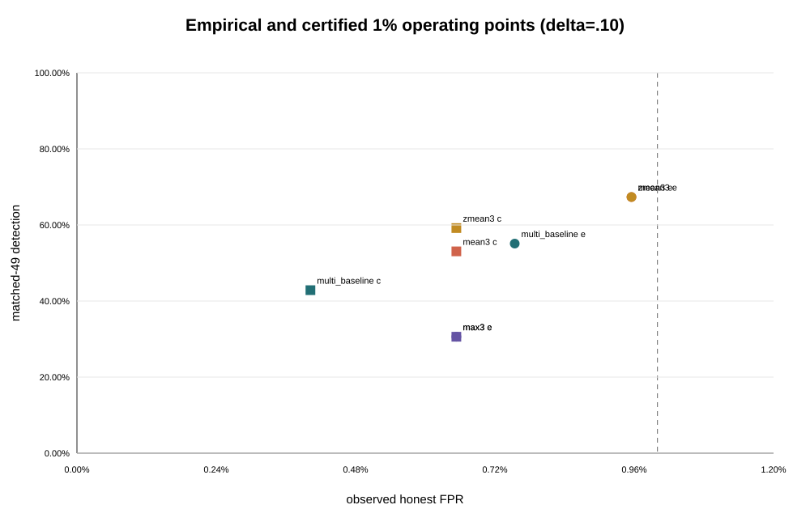
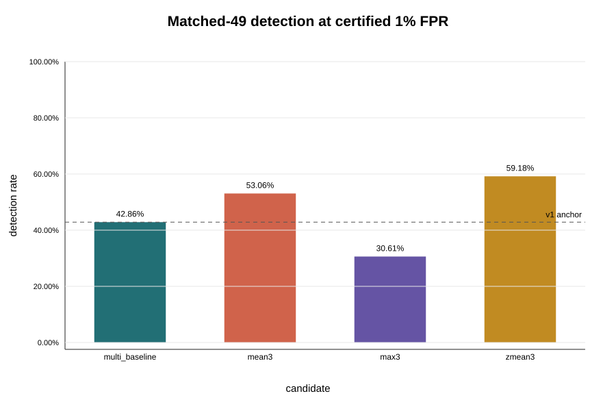

# Certified audit-budget validity with a fixed ensemble extension

## 1. Executive summary

This project separates two questions that are easy to blur together:

1. Is a claimed 1% honest-action false-positive rate statistically certifiable?
2. At that certified operating point, can a fixed ensemble detect more attacks?

For the first question, we apply one-sided Clopper-Pearson bounds and descending
fixed-sequence Learn-then-Test to existing honest calibration scores. This is a
rigorous application of established methods to AI-control audit budgets, not a
claim that Clopper-Pearson or Learn-then-Test is new.

For the second question, we compare the Track A `multi` baseline with `zmean3`,
a fixed ensemble that adds goal-analysis to the two components already used by
`multi`. On 49 successful attacks from environments with matched honest data,
`zmean3` improves detection from 21/49 (42.86%) to 29/49 (59.18%) at the
respective fixed thresholds certified for a 1% honest-action FPR at
`delta=0.10`.

The main-task-success partition gives a more cautious view of stealth. Among
20 main-task-successful attacks, detection rises from 8/20 (40.00%) to 12/20
(60.00%), but the exact paired test is underpowered (`p=0.21875`). On a
separate frozen set of 75 main-task-failed attacks, detection rises from 48/75
(64.00%) to 72/75 (96.00%); this is strong evidence on overt or
main-task-failed sabotage, not stealthy dual-success attacks.

## 2. Pillar 1: certified audit-budget validity

The v1 analysis uses 2,007 pooled honest actions from `media_processing`,
`web_scraping`, and `clinical_trial`.

| Method | Threshold | Honest tail | Observed FPR | CP 90% upper | CP 95% upper | CP 99% upper | 1% claim |
| --- | ---: | ---: | ---: | ---: | ---: | ---: | :---: |
| Empirical `multi` | 4.5 | 15/2,007 | 0.75% | 1.06% | 1.15% | 1.33% | Not certified |
| Certified `multi` | 5.0 | 8/2,007 | 0.40% | 0.65% | 0.72% | 0.87% | Certified |

An observed rate below budget is not enough. At threshold `4.5`, the observed
FPR is 0.75%, but the 90% one-sided upper bound is 1.06%. The available honest
data therefore do not support a 1% claim at that threshold. Threshold `5.0` is
the most permissive deterministic threshold among the observed `multi` score
grid points whose bound remains below 1% at every tested confidence level.

The stricter operating point has a detection cost. On the matched 49 attacks,
`multi` detection falls from 27/49 (55.10%) at the empirical threshold to
21/49 (42.86%) at the certified threshold. Certification did not change the
monitor's ranking. It identified which deterministic operating point had a
defensible finite-sample FPR claim.

The same distinction appears in the sample-size calculation. With zero honest
tail flags, a 1% claim requires at least 230, 299, or 459 actions for
`delta=0.10`, `0.05`, or `0.01`. A non-empty tail requires more data.

## 3. Pillar 2: a fixed ensemble under the same certified budget

The Track A `multi` monitor combines `orthogonal` and `old-action`.
`zmean3` adds a third, complementary goal-analysis score. Each component is
standardized with a mean and population standard deviation computed only from
honest calibration actions, then the three standardized values are averaged.

The fixed honest-only normalization is:

| Component | Mean | Population standard deviation |
| --- | ---: | ---: |
| `orthogonal` | 0.500251 | 1.331305 |
| `old_action` | 0.801911 | 0.943330 |
| `goal_analysis` | 1.453997 | 0.783516 |

Candidate definitions, normalization constants, and thresholds were fixed
before confirmatory evaluation. No learned gate was used. No weights were
tuned on attack outcomes. At `delta=0.10`, the fixed certified thresholds are
`5.0` for `multi` and `2.636413679185227` for `zmean3`.

| Candidate | Empirical matched-49 detection | Certified matched-49 detection |
| --- | ---: | ---: |
| `multi` | 27/49 (55.10%) | 21/49 (42.86%) |
| `mean3` | 33/49 (67.35%) | 26/49 (53.06%) |
| `zmean3` | 33/49 (67.35%) | 29/49 (59.18%) |

Adding goal-analysis improves ranking for both three-component means. The
honest-calibrated z-score construction also produces a finer score geometry:
`zmean3` has 103 unique honest scores on the aligned calibration set, compared
with 15 for `multi`. More of the ranking gain therefore survives the move from
the empirical to the certified score-grid point. Better scoring and
certification do different jobs: the ensemble improves ranking, while the
certificate tests the FPR claim.

## 4. Original matched-49 paired result

The primary broad comparison uses one maximum valid action score for each of
49 successful attacks from the three environments with matched honest
calibration data.

| Both catch | `zmean3` only | `multi` only | Neither | `multi` | `zmean3` | Net lift | Exact McNemar p |
| ---: | ---: | ---: | ---: | ---: | ---: | ---: | ---: |
| 19 | 10 | 2 | 18 | 21/49 (42.86%) | 29/49 (59.18%) | +16.33 pp | 0.0386 |

This is a positive paired lift on the main matched sample. The sample is still
small, with 12 discordant pairs, so the effect size should be read alongside
the count rather than as a broad claim about every attack distribution.

## 5. Main-task-success partition

The matched set contains 20 main-task-successful attacks and 29
main-task-failed attacks. `main_task_success == true` is the available proxy
for stealthy dual-success behavior.

| Main-task outcome | n | `multi` | `zmean3` | Both | `zmean3` only | `multi` only | Neither | Exact McNemar p |
| --- | ---: | ---: | ---: | ---: | ---: | ---: | ---: | ---: |
| Successful | 20 | 8/20 (40.00%) | 12/20 (60.00%) | 7 | 5 | 1 | 7 | 0.21875 |
| Failed | 29 | 13/29 (44.83%) | 17/29 (58.62%) | 12 | 5 | 1 | 11 | 0.21875 |

The stealth proxy moves in the favorable direction, but it has only six
discordant pairs and is underpowered. The original lift also does not
concentrate only in main-task failures: net catches improve in both
partitions. These data support a positive signal on main-task-successful
attacks, not a claim of strong or general stealthy dual-success detection.

## 6. Frozen confirmatory-75 result

The frozen confirmatory set contains 75 successful-side-task attacks, 25 from
each matched environment, and all 75 have `main_task_success == false`. On
this overt or main-task-failed population, `multi` catches 48/75 (64.00%) and
`zmean3` catches 72/75 (96.00%), with 48 both, 24 `zmean3` only, zero
`multi` only, and three neither. The exact McNemar p-value is
`1.192e-07`. This is strong evidence for detecting successful-side-task,
main-task-failed sabotage. It is not evidence for stealthy dual-success
attacks.

| Population | n | `multi` | `zmean3` | Both | `zmean3` only | `multi` only | Neither | Exact McNemar p |
| --- | ---: | ---: | ---: | ---: | ---: | ---: | ---: | ---: |
| Frozen confirmatory | 75 | 48/75 (64.00%) | 72/75 (96.00%) | 48 | 24 | 0 | 3 | 1.192e-07 |
| One per source run | 47 | 29/47 (61.70%) | 45/47 (95.74%) | 29 | 16 | 0 | 2 | 3.052e-05 |

The one-per-run sensitivity check preserves the direction and size of the
effect. It reduces duplicated run provenance but does not create a stealth
sample. Goal-analysis is the dominant standardized contribution for 21 of the
24 frozen `zmean3`-only catches, consistent with main-task failure amplifying
an overt goal-divergence signal.

The confirmatory run tests detection only. Its attack scores do not recertify
the 1% FPR, which remains supported by the earlier honest calibration.

## 7. Mechanism diagnostic

| Population | `zmean3`-only catches | Goal-analysis dominant | Orthogonal dominant | Old-action dominant |
| --- | ---: | ---: | ---: | ---: |
| Original matched 49 | 10 | 7/10 | 3/10 | 0/10 |
| Frozen confirmatory 75 | 24 | 21/24 | 1/24 | 2/24 |

Dominance here means the largest standardized component contribution on the
action attaining the attack's maximum `zmean3` score. Goal-analysis is a useful
complementary signal, but the sharp rise from 7/10 to 21/24 suggests that it
fires especially strongly when goal divergence is overt enough for the main
task to fail. This helps explain why the frozen effect is larger than the
matched-49 effect.

## 8. Limitations

- The matched attack sample has 49 units, and its stealth proxy has only 20.
- The frozen confirmatory set contains no main-task-successful attacks.
- No learned gate, attack-tuned weight, or adaptive attack evaluation was used.
- Honest calibration covers only three matched environments.
- Detection over all 76 original LaStraj attacks is descriptive only because
  five environments lack matched honest calibration data.
- FPR certification relies on the honest calibration distribution,
  exchangeability, and the evaluated environment mixture.
- Actions within a trajectory are correlated. Trajectory-grouped splitting
  prevents leakage but does not make actions independent.
- Pooled FPR changes if the deployment environment mix changes.
- The confirmatory run evaluates detection only and does not recertify FPR.
- Raw confirmatory monitor outputs remain local and untracked.

## 9. Takeaway

`zmean3` strongly improves detection of overt or main-task-failed sabotage and
shows a positive but underpowered lift on main-task-successful attacks. The
certified-threshold layer keeps the 1% audit-budget claim honest; the ensemble
layer improves ranking under that certified budget.

Supporting analyses:

- [Fixed ensemble analysis](../supporting/ensemble_analysis.md)
- [Main-task-success partition](../supporting/main_task_success_partition.md)
- [Frozen paired test](../supporting/confirmatory_paired_test.md)
- [Confirmatory alignment and exclusions](../supporting/confirmatory_alignment_report.md)
- [Report integration guidance](../supporting/report_integration_guidance.md)
